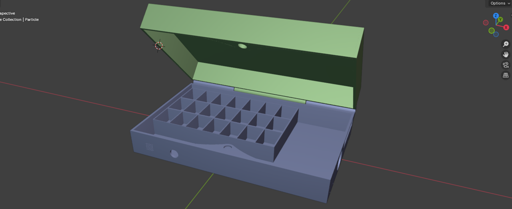

# Smart Box for Therapy Telemonitoring

## Overview

Smart Box for Therapy Telemonitoring is an IoT system based on Particle Argon that improves medication adherence and ensures proper drug storage. The device provides scheduled reminders, detects hatch interaction, monitors temperature and humidity, and publishes telemetry to the Particle Cloud for remote monitoring by caregivers or medical staff.

## Key Features

- Scheduled audio-visual reminders (buzzer + RGB LED) aligned to therapy windows
- Latching intake logic: alerts remain active until the patient opens the hatch
- Discreet mode after the window: no audible alerts, continued missed-intake notifications
- Environmental monitoring via DHT11 temperature and humidity sensor
- Hatch open/close detection via ultrasonic distance sensor
- Particle Cloud integration for telemetry and alerts

## Hardware

For a concise component list, see [README_COMPONENTS.md](README_COMPONENTS.md).

| Component | Model | Pin(s) | Notes |
| --- | --- | --- | --- |
| Microcontroller | Particle Argon | - | Main device |
| Ultrasonic sensor | Grove Ultrasonic Ranger | D4 | Hatch distance |
| Temp/Humidity sensor | DHT11 | D2 | Environmental monitoring |
| Display | Grove 4-Digit Display (TM1637) | D1 (CLK), D0 (DIO) | Time display |
| Status LED | Grove Chainable RGB LED | A4 (Data), A5 (Clock) | Status indicator |
| Buzzer | Grove Buzzer | A0 | Audible alerts |

## Firmware Structure

- Entry point: [src/main.cpp](src/main.cpp)
- Third-party libraries: [lib](lib) (Particle-style layout)

## 3D Model

The enclosure was modeled in 3D by the author, including pill compartments shaped as a slide to make pill pickup easier. Exported STL files are available in [cad](cad):

- [cad/Sopra.stl](cad/Sopra.stl)
- [cad/Sotto.stl](cad/Sotto.stl)

## Project Media

Simulation video: [smart-box-simulation.mp4](media/smart-box-simulation.mp4)

## Logic Summary

The firmware implements a lightweight state machine:

- Trigger: at scheduled hours, therapy becomes active if not already completed
- Active monitoring: audio/visual alerts continue until the hatch is opened
- Reset and telemetry: a hatch opening logs the intake and resets the session

## Cloud Events

- `Therapy Alert`: periodic reminder if the patient is late
- `Drive Alert`: hatch opened (therapy intake confirmed)
- `Cover Alert`: hatch left open or opened outside schedule
- `Environment Alert`: temperature or humidity out of range

## Build and Flash

Requirements:

- Particle account and access to Particle Web IDE or Particle Workbench
- Libraries already included under [lib](lib)

Typical workflow:

- Open the folder in VS Code with Particle Workbench
- Use "Particle: Cloud Flash" or "Particle: Compile"
- Optional CLI: `particle flash` or `particle compile`

Compiled binaries are not tracked in git; generate them locally if needed.

## Monitoring

Use Particle Console to monitor:

- `BoxTemp`, `BoxHumid`, and `Distance` variables
- Published events listed in the Cloud Events section

## Author

Andrea Diano (IoT Frameworks project)

## License

MIT
